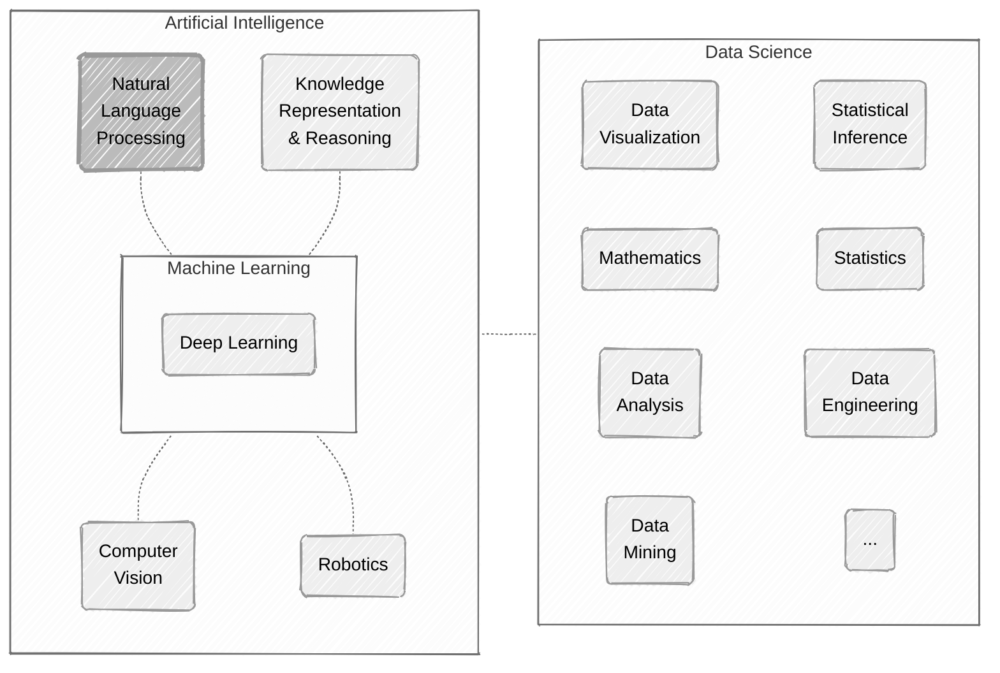
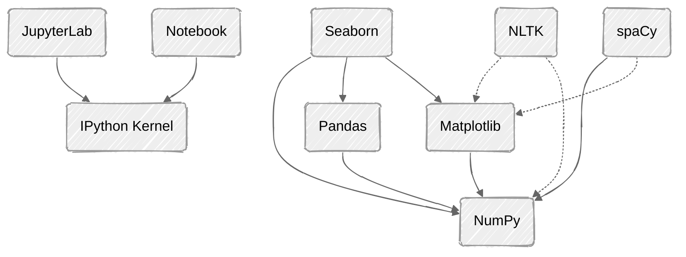

# nlp-playground

Natural Language Processing playground to play around and learn NLP related skills.



## Library Dependencies



## Jupyter Lab execution

To run **Jupyter Lab** use the **run.sh** script in the root of the project (virtualenv is automatically created by **uv**):
```
$ ./run.sh
```

## Git commit workflow

It's enough to user **jupyter nbconvert --clear-output** by hand to keep it simple (for now):

```
$ git add some_file.ipynb

$ uv run jupyter nbconvert some_file.ipynb --clear-output

$ git diff --staged
  (... check the full diff ...)

$ git diff
  (... check "execution=null" and "outputs=[]" ...)

$ git add some_file.ipynb

$ git diff
  (... check final diff ...)

$ git commit ...
```

---

## ⚠️ (legacy) Anaconda setup

Even though there are thinner alternatives I'm using **Anaconda** to have as much software available as possible:

- Go to https://www.anaconda.com/ → (Free Downdload) → https://www.anaconda.com/download
- Download **Anaconda Distribution** → https://repo.anaconda.com/archive/Anaconda3-2025.12-2-Linux-x86_64.sh

It's quite large:

```
$ ls -l Anaconda3-2025.12-2-Linux-x86_64.sh
-rw-rw-r-- 1 sfm sfm 1277826351 May  9 16:26 Anaconda3-2025.12-2-Linux-x86_64.sh
```

I'm using an already created **/anaconda3** folder. Even though it's empty option **-u** (update an existing installation) must be provided to avoid messages like:

```
$ bash Anaconda3-2025.12-2-Linux-x86_64.sh -p /anaconda3
(...)
ERROR: File or directory already exists: '/anaconda3'.
If you want to update an existing installation, use the -u option.
```

So **-u** option is used:

```
$ bash Anaconda3-2025.12-2-Linux-x86_64.sh -p /anaconda3 -u
(...)
Preparing transaction: done
Executing transaction: done
installation finished.
WARNING:
    You currently have a PYTHONPATH environment variable set. This may cause
    unexpected behavior when running the Python interpreter in Anaconda3.
    For best results, please verify that your PYTHONPATH only points to
    directories of packages that are compatible with the Python interpreter
    in Anaconda3: /anaconda3
Do you wish to update your shell profile to automatically initialize conda?
This will activate conda on startup and change the command prompt when activated.
If you'd prefer that conda's base environment not be activated on startup,
   run the following command when conda is activated:

conda config --set auto_activate_base false

Note: You can undo this later by running `conda init --reverse $SHELL`

Proceed with initialization? [yes|no]
[no] >>> no

You have chosen to not have conda modify your shell scripts at all.
To activate conda's base environment in your current shell session:

eval "$(/anaconda3/bin/conda shell.YOUR_SHELL_NAME hook)"

To install conda's shell functions for easier access, first activate, then:

conda init

Thank you for installing Anaconda3!
```

### ⚠️ (legacy) Conda activate

```
$ eval "$(/anaconda3/bin/conda shell.zsh hook)"
```

### ⚠️ (legacy) Conda deactivate

```
$ conda deactivate
```

### ⚠️ (legacy) Jupyter Lab execution

To run **Jupyter Lab** using **Anaconda3** set **LEGACY=1** before using **run.sh** (some notebooks still need this to find the required libraries):

```
$ LEGACY=1 ./run.sh
```
