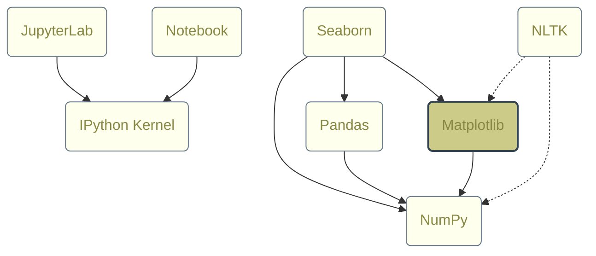

# Matplotlib

**Matplotlib** examples.

## Library Dependencies

```mermaid
graph TD
    jupyterlab(JupyterLab)
    notebook(Notebook)
    ipykernel(IPython Kernel)
    numpy(NumPy)
    matplotlib(Matplotlib)
    pandas(Pandas)
    seaborn(Seaborn)
    nltk(NLTK)

    jupyterlab --> ipykernel
    notebook --> ipykernel
    matplotlib --> numpy
    pandas --> numpy
    seaborn --> numpy
    seaborn --> pandas
    seaborn --> matplotlib
    nltk -.-> matplotlib
    nltk -.-> numpy

    classDef default fill:#ffe,stroke:#678,stroke-width:1px,color:#884;
    classDef highlight fill:#cc8,stroke:#345,stroke-width:2px
    class matplotlib highlight
```

## References

- **[Matplotlib](https://matplotlib.org/)**
- https://github.com/matplotlib/matplotlib
