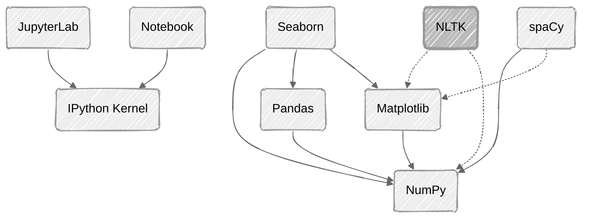

# NLTK

**NLTK** examples.

## Library Dependencies

```mermaid
---
config:
  look: handDrawn
  theme: neutral
---
graph TD
    jupyterlab(JupyterLab)
    notebook(Notebook)
    ipykernel(IPython Kernel)
    numpy(NumPy)
    matplotlib(Matplotlib)
    pandas(Pandas)
    seaborn(Seaborn)
    nltk(NLTK)
    spacy(spaCy)

    jupyterlab --> ipykernel
    notebook --> ipykernel
    matplotlib --> numpy
    pandas --> numpy
    seaborn --> numpy
    seaborn --> pandas
    seaborn --> matplotlib
    nltk -.-> matplotlib
    nltk -.-> numpy
    spacy --> numpy
    spacy -.-> matplotlib

    classDef highlight fill:#bbb,stroke-width:3px,color:#000
    class nltk highlight
```

## References

- **[NLTK](https://www.nltk.org/)**
- https://github.com/nltk/nltk
- https://github.com/l-newbould/introtonlp-365
