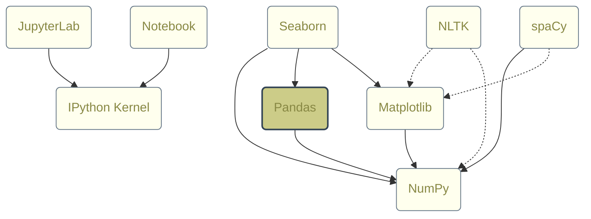

# Pandas

**Pandas** examples.

## Library Dependencies

## References

- **[Pandas](https://pandas.pydata.org/)**
- [10 minutes to pandas](https://pandas.pydata.org/docs/user_guide/10min.html)
- [Pandas_Cheat_Sheet.pdf](https://pandas.pydata.org/Pandas_Cheat_Sheet.pdf)
